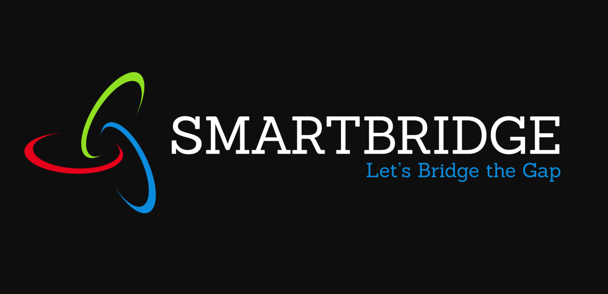

# Customer Service Chatbot using *Smart Document Understanding* 

Intelligent Customer Help Desk With Smart Document Understanding is an application that is fulfilled with SDU [Smart Doc. Understanding] feature. This feature is an ability to understand relevant information of documents and learn from annotation or past experiences that processed through Watson Discovery an IBM Cloud Service. In the end, it forms as a  bot / virtual assistant that helps into customer services by its trained knowledge that has driven from different learning paths (Watson Assistant, Cloud Functions). 

### Existing Problem
- Bots are of course a very good technological approach. But, it has also some problem and their basic operations that are not    fit for effective customer services. Bots do all basic operations like Greetings, wishes, and appointments, all things are      there but it’s not complete because it’s important to cover the maximum problem of customers and resolve them with it’s        learning experience.  
### Proposed Solution
- To make the bots up to the merits of customer service, we have to add more features by bots learning grows up and they learn    from its experiences. This is possible through IBM Watson Services. Watson Service is of many types in that Discovery is        service that helps to learn and provide a smart understanding to target systems like bots.
-  IBM Watson Discovery process structured, semi-structured and unstructured data to do Watson training on targeted documents.    Natural Language Processing makes this happens with different supported formats by Watson Discovery. To improve the trained    model we have to do some more efforts like annotate the document with some useful levels. 

